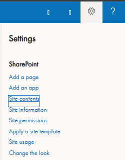
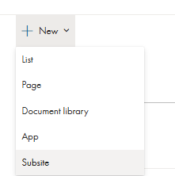
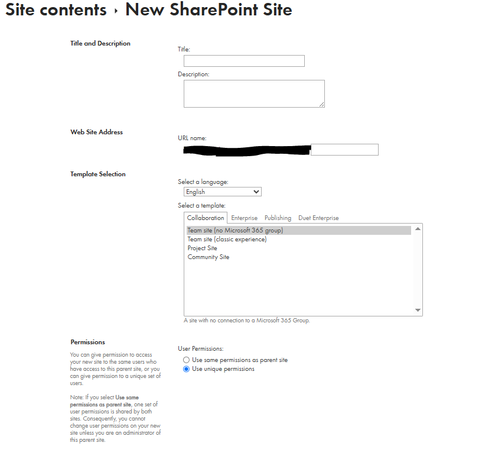
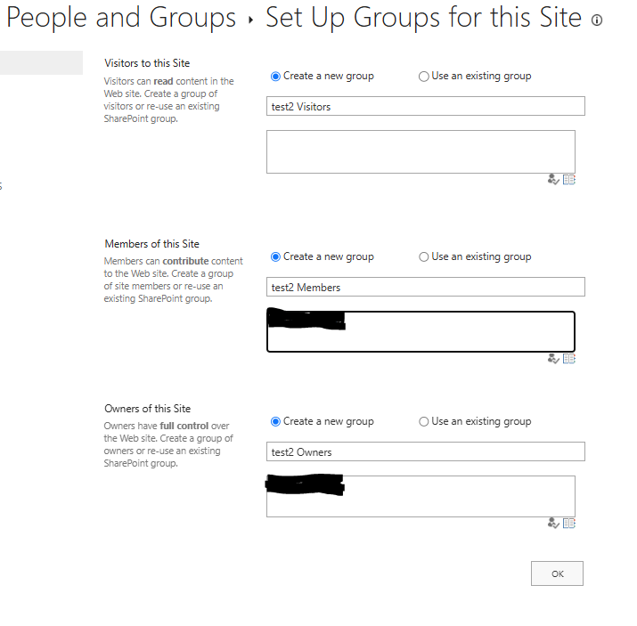
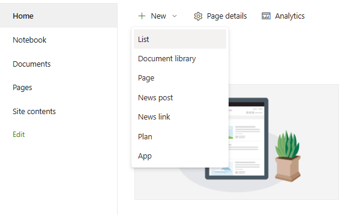
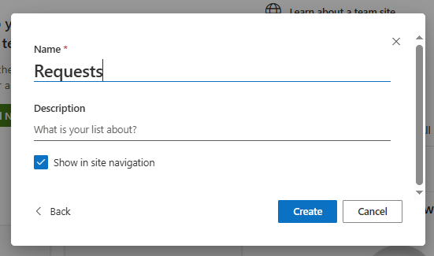
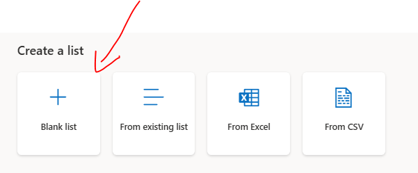
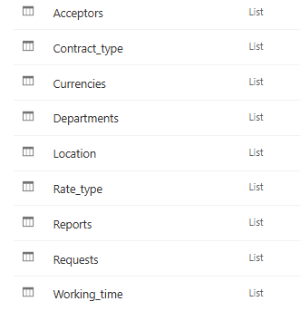
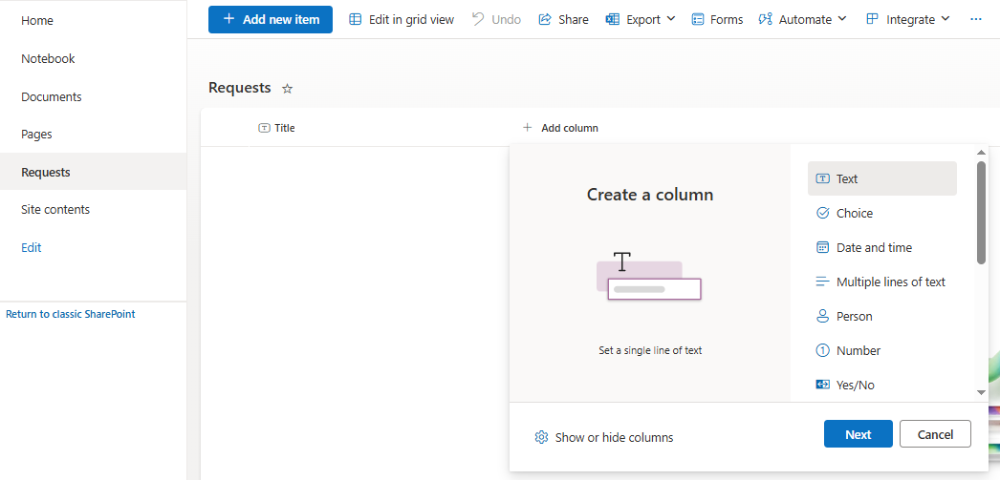
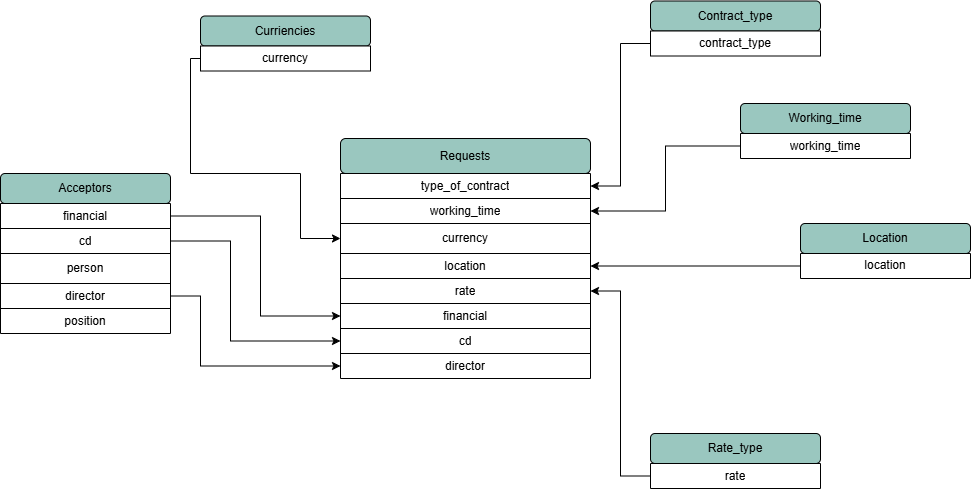

# SharePoint Subsite and List Creation Guide

## 1. Creating a Subsite

1. Navigate to the desired SharePoint site.
2. Click on **Site Contents**.
3. Go to the **Subsites** tab and click on **New**.
4. Select **Subsite** and name it **Recruitment Request**.
5. Set the URL to `recruitment-request`.
6. Click **Create**.
7. Choose the appropriate permission groups:
   - Click **Next**.
   - Proceed to list creation.

   
   
   
   

## 2. Creating Lists

1. Inside the newly created subsite, click **New** → **List**.
2. Select **Blank List**.
3. Enter the **List Name** and proceed.
4. Enable the **Show in site navigation** option for better accessibility.
5. Assign permissions for each list:
   - Users responsible for adding new locations or currencies should have **edit permissions**.
   - Other users should have **read-only permissions** to prevent unauthorized modifications.
   - For better security, consider creating a third group with **higher permissions** than HR:
     - HR should only have **add permissions** without deletion rights.
     - The responsible person should have the highest **Edit permissions**.

## 3. Column and List View Preview and Relationship Diagram

[Download schema](../../../sharepoint/sharepoint_schema_overview.xlsx)

