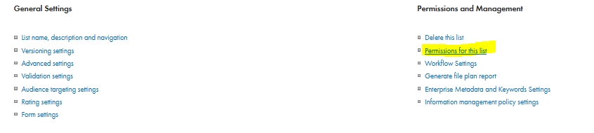

# SharePoint Security – Restricted Access & Record Addition Control  

## Securing SharePoint Access  

To ensure that only authorized personnel can access SharePoint and prevent users from adding new records directly, follow these steps:  

### 1. Creating Security Groups in Azure  
- Create two **Microsoft 365 security groups** in Azure:  
  - **All Access Group** – for standard access.  
  - **HR Access Group** – for advanced access.  
- Optionally, assign a **group leader** who can manage group memberships via:  
  [Microsoft Account Groups](https://myaccount.microsoft.com/groups/groups-i-own).  
- The group leader will be able to add or remove members as needed.  

### 2. Assigning Groups to SharePoint Subsite  
- When creating a **SharePoint subsite**, add both security groups to ensure that permissions **inherit across all lists**.  
- Alternatively, manually configure permissions for each list:  
  1. Open the **list settings** (top-right corner).  
  2. Navigate to **Permissions for this list**.  
  3. Click **Stop Inheriting Permissions**.  
  4. Select **Grant Permissions** and add the security groups.  
  5. Assign appropriate permission levels.  
  6. Uncheck the notification option to avoid unnecessary emails to people.  
  
  
  
  
  

---

## Restricting Submission Permissions (Insert-Only)  

To ensure users can **only submit records only from powerapps app without viewing or modifying record on sharepoint** existing ones, create a custom **Insert-Only** permission level. This prevents unauthorized access to sensitive HR data.  

### Steps to Create "Insert-Only" Permissions  
1. Navigate to the **subsite settings**:  
   - Click **Site Information** → **View All Site Settings** → **Site Permissions**.  
2. Click **Permission Levels**, then select **Manage permission levels on parent site**.  
3. Click **Add Permission Level**.  
4. Configure the permission settings according to the screenshots below.

This restriction ensures that:  
✅ Users can **submit** new records.  
❌ Users **cannot view**, or delete existing records from sharepoint.  
❌ Users **cannot modify list views** (e.g., add columns to view or create personal views or see history version on records).  

---

## Creating "Edit Without Delete" Permissions  

For users who need editing capabilities **without deletion rights**, create a custom permission level:  

1. Go to **Permission Levels** and select **Add Permission Level**.  
2. Name it **"Edit Without Delete"**.  
3. Uncheck the **Delete** option while keeping edit rights enabled.  

This setup enhances data security by **preventing accidental deletions** while still allowing necessary modifications.

---

## Modifying the Default SharePoint Form to Restrict Direct Add Requests from SharePoint Form

To further **secure the submission process** and ensure that new records are only added through the official application, the default SharePoint form should be modified.  

### Steps to Customize the Form with PowerApps  

1. Go to the **List Settings**.  
2. Select **Form Settings**.  
3. Click **Customize with PowerApps**.  
4. Remove all default fields and controls from the form.  
5. Add visual elements such as:  
   - **An information message** explaining that requests must be submitted via the official application.  
   - **A button or link** redirecting users to the correct application.  

---

With this approach, SharePoint remains a **secure and controlled** environment where sensitive HR data is protected from unauthorized modification and display by unauthorized persons.  
