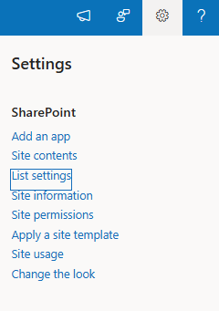
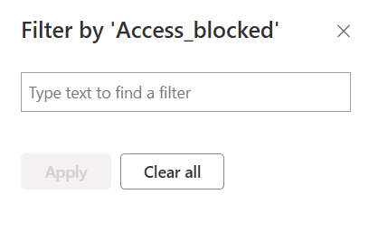

# Configuring SharePoint Views for Access Control

## Creating a Restricted View

### 1. Navigate to List Settings

- Scroll down to the bottom and select **Create View**.
- Choose the default **All Items** view.  
  
  

### 2. Adding an Access Control Column

- After adding the necessary columns, create an additional column to indicate restricted access.
- Name this column **access_blocked** (Text type).
- This column will serve as a visual cue for users without the required permissions.  
  

### 3. Applying a Filtering Trick

- Open the **All Items** view settings and navigate to the **Filter** section.
- Set the filter condition:
  - **Comment begins with [Me]**
- This ensures that no records match the condition, resulting in an empty list.  
  

### 4. Styling the View

- Go to the **Style** section and select **Boxed, no labels**.
- This enhances the display of the restricted view.  
  

### 5. Configuring Mobile View

- Enable the option to make this the **default mobile view**.  
  

---

## Creating a Personal View for Advanced Users

Since our application does not include a built-in module for tracking version history, creating a dedicated view for version tracking can be helpful, especially for HR.

### Steps to Create a Custom View

1. Navigate to **Create View** and select **Standard View**.
2. Name the view, e.g., **my-view**.
3. Select all necessary fields that should be included in the view.
4. Mark this view as **Personal View** (only available to you).  
   
   
   

---

## View Access Restrictions Demonstration

Below are two screenshots demonstrating the results of the access control settings:

1. **Restricted User View:**

   - Only the **access_blocked** column is visible.
   - The user cannot modify, add, or delete records.
   - They also cannot add new columns to the view.

   
   
   
   

2. **HR/Administrator View:**

   - Users with higher permissions can see additional columns.
   - They have the ability to add new columns to **my-view**.
   - Additional restrictions can be applied to prevent column modifications if necessary.

   
   

---

By following this configuration, you can effectively restrict access to SharePoint views while allowing privileged users to perform necessary actions.
